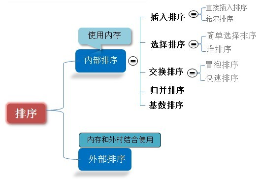
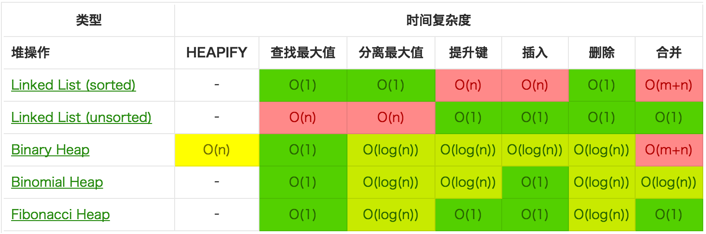
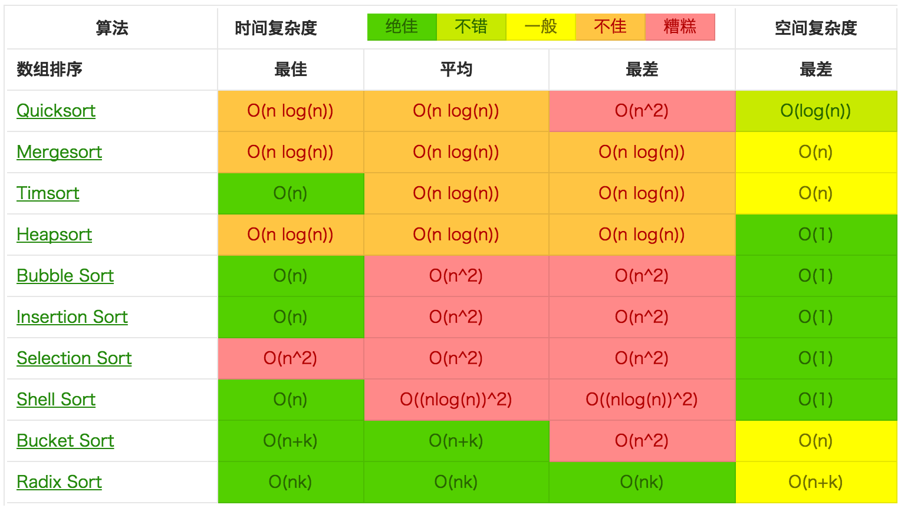
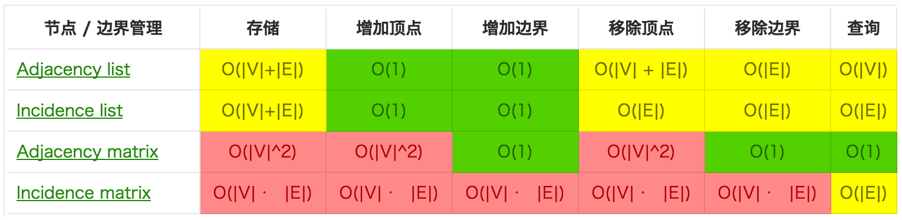
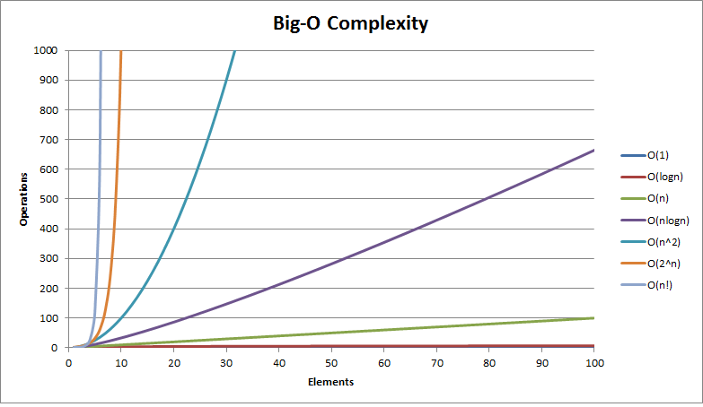

# 排序算法

可参考：

- [八大排序算法](http://blog.csdn.net/hguisu/article/details/7776068)
- [九大排序算法再总结](http://blog.csdn.net/xiazdong/article/details/8462393)
- [视觉直观感受 7 种常用的排序算法](http://blog.jobbole.com/11745/)

排序有内部排序和外部排序，内部排序是数据记录在内存中进行排序，而外部排序是因排序的数据很大，一次不能容纳全部的排序记录，在排序过程中需要访问外存。

当n较大，则应采用时间复杂度为O(nlog2n)的排序方法：快速排序、堆排序或归并排序序。

快速排序：是目前基于比较的内部排序中被认为是最好的方法，当待排序的关键字是随机分布时，快速排序的平均时间最短；

